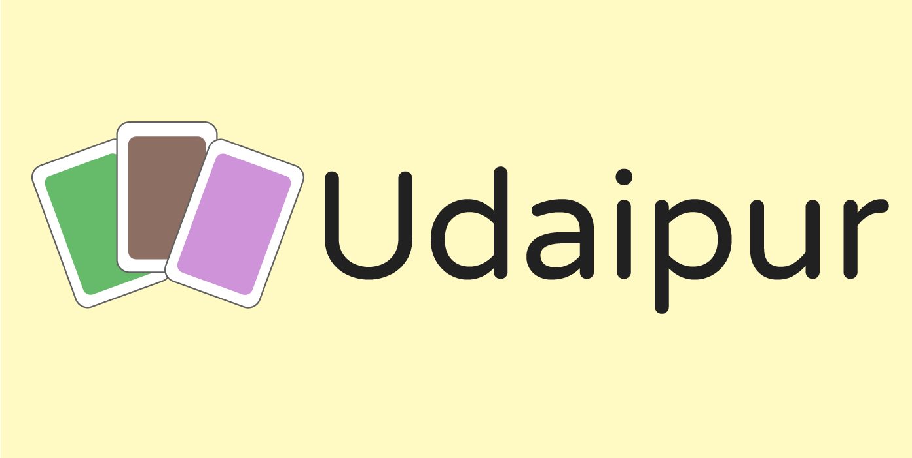
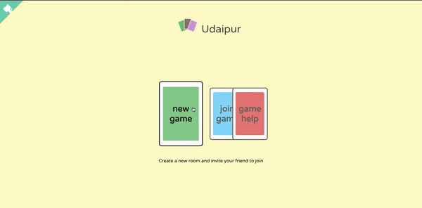
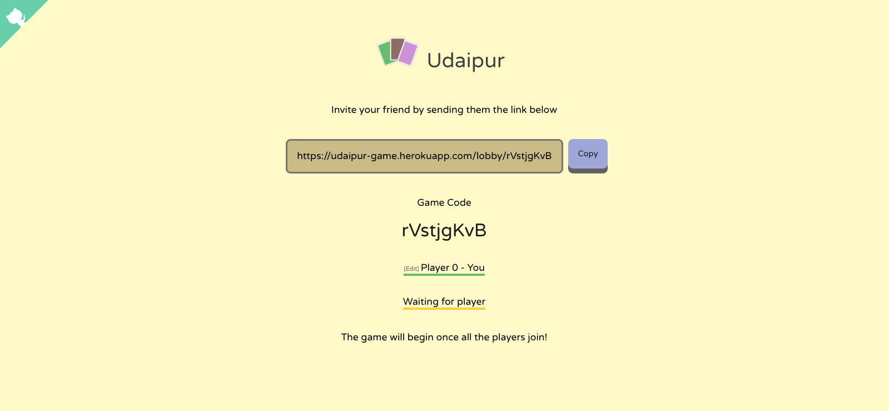
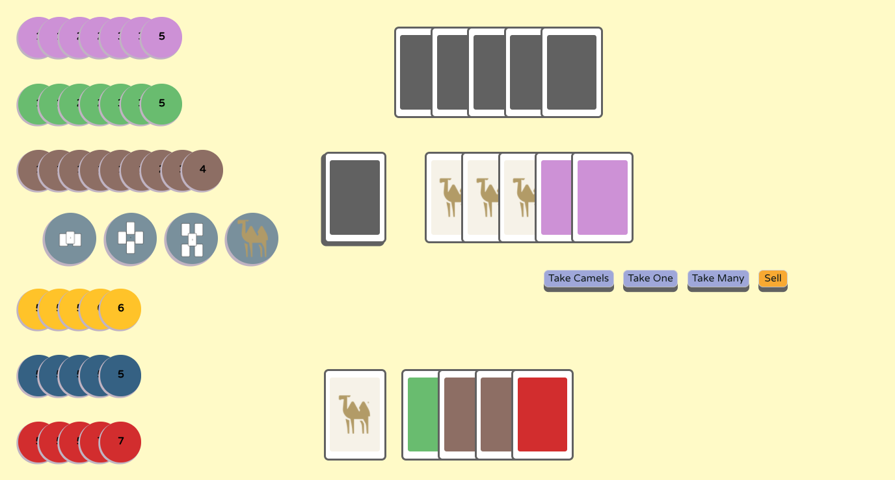

# Udaipur

A minimalistic clone of the popular 2-player card trading board game [Jaipur](https://boardgamegeek.com/boardgame/54043/jaipur) with **Online Multiplayer** support built using [boardgame.io](https://github.com/nicoldavis/boardgame.io) and React JS.

You can try out the game at https://udaipur-game.herokuapp.com/ (It can be a bit slow to load initially since it's currently running on a free dyno).

Jaipur on [BoardGameGeek](https://boardgamegeek.com/boardgame/54043/jaipur)

## About the Game

Jaipur is a 2 player, trading card game where you and your opponent are traders and are trying to make the most money, buying and selling resources from the market. Resources initially sell for a larger amount and start to yield lesser money as more of them get sold in the market.

However not all resources have the same availability and selling price along with Rare Resources having the added constraint of needing to be sold in a group of atleast 2 cards at a time.

In the game of Jaipur, players have to strike a balance between trying to trade rarer resources which sell for more(such as Gold, Diamond and Silver) and the more abundant resources which sell for less(Leather, Spices and Silk).

For a more comprehensive explanation of the rules, watch the game guide here:  
.

You can also find help within the Udaipur Website under [Game Help](https://udaipur-game.herokuapp.com/help)
The only departure from the original rules in Udaipur is the removal of the **Seal of Excellence** tokens to simplify and shorten the game.

## Development

- Run `npm install` to install the necessary packages
- Run `npm run client` to run the front-end client
- Run `npm run server` to run the game server

## Deployment

- Set `APP_PRODUCTION=true` in **src/config.js**
- Run `npm run start` to deploy the app

Deploy to **Heroku** with the button below.  

## Future Additions

- [x] Player move history in a sidebar (Commit [69e19588e7](https://github.com/skvrahul/UdaipurGame/commit/69e19588e7bd186ae4be670f32f510e48848a2c9))
- [x] Display player Scoreboard while playing (Commit [2629c091f](https://github.com/skvrahul/UdaipurGame/commit/2629c091fa78b1268923d19f72fce92c0741c133))
- [ ] Use boardgame.io's STRIP_SECRETS to ensure the Client doesn't receive extra information about the opponent
- [ ] Clearer way to represent players receiving token(s)

## Screenshots

### Home Page

### Lobby

### Game Board

